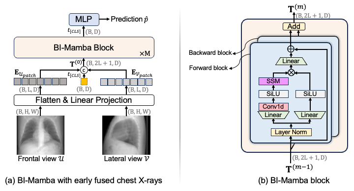

# BI-Mamba
## Abstract

We propose Bidirectional Image Mamba (BI-Mamba) to complement the unidirectional SSMs with opposite directional information. BI-Mamba utilizes parallel forward and backward blocks to encode long-range dependencies of multi-view chest X-rays. We conducted extensive experiments on images from 10,395 subjects in National Lung Screening Trail (NLST). Results show that BI-Mamba outperforms ResNet-50 and ViT-S with comparable parameter size, and saves significant amount of GPU memory during training. Besides, BI-Mamba achieves promising performance compared with previous state of the art in CT, unraveling the potential of chest X-ray for CVD risk prediction. Our paper introducing BI-Mamba was early accepted for MICCAI 2024: https://arxiv.org/pdf/2405.18533.



## Requirements

```
cd /path/to/BI-Mamba
pip -r install ./vim/vim_requirements.txt
```

## Training and evaluation

The checkpoint pretrained on ImageNet named **vim_s_midclstok_ft_81p6acc.pth** to initialize the BI-Mamba backbone is available [here](https://huggingface.co/hustvl/Vim-small-midclstok/tree/main). Special thanks to [Vim](https://github.com/hustvl/Vim) for their open-source code and checkpoints.

Finetuning from the checkpoint (recommended):

```
bash ./mamba-cxr/scripts/ft-vim-s.sh
```

Evaluation:

```
bash ./mamba-cxr/scripts/eval-vim-s.sh
```

Training from stratch:

```
bash ./mamba-cxr/scripts/pt-vim-s.sh
```

## Citation

```
@article{yang2024cardiovascular,
  title={Cardiovascular Disease Detection from Multi-View Chest X-rays with BI-Mamba},
  author={Yang, Zefan and Zhang, Jiajin and Wang, Ge and Kalra, Mannudeep K and Yan, Pingkun},
  journal={arXiv preprint arXiv:2405.18533},
  year={2024}
}
```
